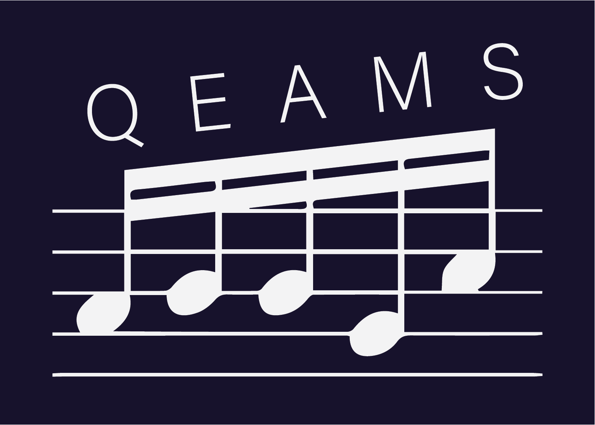
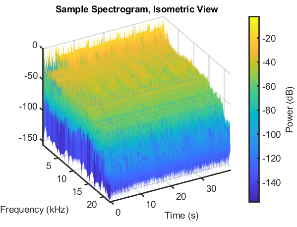

# QEAMS - Qualitative Eclectic Automated Music Splicer

By Samuel Cabrera Valencia and Daniel Arnott

As part of our final project in Quantitative Engineering Analysis 2 (QEA 2), we explored the possibility of using spectrogram analysis and different signal processing techniques to see if we can write a program that would automatically create a playlist "mashup" given a user-inputted playlist of full-length songs.

## Introduction

Governing Question: Can matching time frame slices of a song's spectrogram be used to sync up music?

In this project we want to explore the possibility of using spectrogram analysis and different signal processing techniques to see if we can create a program that can automatically find the best fit song to mash up with a user-inputted sing given the frequencies at a defined moment in the user-inputted song.

This is very similar to the technology that the song finding app "Shazam" uses except for some key differences in implementation. Shazam procedurally generates a spectrogram based off the audio input it is getting from the phone's microphone and finds the song that most fits with this generated spectrogram through a large library of spectrograms that the app has saved. In our case, we will likely have a smaller library for mixing songs, and we, as users, will decide at what point in the inputted song that we want to select a new song to be "mashed in."

This will be more similar to the "AutoMashUpper" detailed in the research paper (cited in the Resources section) by a team at the National Institute of Advanced Industrial Science and Technology (AIST), Japan.

## What is a Spectrogram

A spectrogram is a visual representation of the spectrum of frequencies that a signal possesses over time. It technically has three measurable quantities, all 3 of which can be seen on the example spectrogram here (left).

This is an example of a spectrogram for one of the songs we used while gathering data for our prototype. Spectrograms are a powerful tool for analyzing signals that where both the frequencies and the time in which those frequencies appear are important, such as music!

## Function Workflow

With this pipeline, a user can simply run the program on a folder full of .wav files and produce a mix with ease!

## From Signal to Spectrogram and Back

Using MATLAB's built-in Spectrogram function, we can convert input signals into spectrograms accurately and efficiently. To convert back, we use the IFFT function from the following MATLAB community toolbox by Ph.D. Eng. Hristo Zhivomirov (posted on 12/21/13)

## Algorithm Workflow

## Finding Similarity Between Two Songs

For a generalized formula, we can simply take the difference in value for an i-point DFT at each point I. For each difference, square it, add all of these together and take the square root. We can experimentally determine what a minimum "threshold" value is for this distance and use it as a cutoff for deciding whether to change the song or keep playing it.

Below is the equation we implemented for calculating this difference.

INSERT EQUATION HERE

## Mashups

Here is one of the mashups we've made using this program. Enjoy! (Unfortunately we can only show a few mashups according to Fair Use. We made a bunch of other mashups that came out really well, however!)

[royalty_free_mix](/royalty_free_mix.wav)

[bilingual_muisc_mix](/bilingual_pop_n_stuff.wav)

Copyright Disclaimer: Under Section 107 of the Copyright Act 1976, allowance is made for "fair use" for purposes such as criticism, comment, news reporting, teaching, scholarship and research. Fair use is a use permitted by copyright statute that might otherwise be infringing. Non-profit, educational or personal use tips the balance in favor of fair use.

## Resources

MATLAB Library

Zhivomirov, Hristo. “Isft.” MathWorks Help Center, MathWorks, 26 Dec. 2013, www.mathworks.com/help/signal/ref/istft.html.

Zhivomirov, Hristo. “Stft.” MathWorks Help Center, MathWorks, 26 Dec. 2013, www.mathworks.com/help/signal/ref/stft.html.

Readings / Videos

Davies, Matthew & Hamel, Philippe & Yoshii, Kazuyoshi & Goto, Masataka. (2014). AutoMashUpper: Automatic Creation of Multi-Song Music Mashups. Audio, Speech, and Language Processing, IEEE/ACM Transactions on. 22. 1726-1737. 10.1109/TASLP.2014.2347135. 

Cooper, Trey. “How Shazam Works.” Medium, Medium, 29 Jan. 2018, https://medium.com/@treycoopermusic/how-shazam-works-d97135fb4582.

carykh. “Computer Tries to Replicate My Voice!” YouTube, YouTube, 15 Aug. 2017, www.youtube.com/watch?v=jSsMqjMcRAg.

carykh. “AI Evolves to Compose 3 Hours of Jazz!” YouTube, YouTube, 4 July 2017, www.youtube.com/watch?v=nA3YOFUCn4U.
